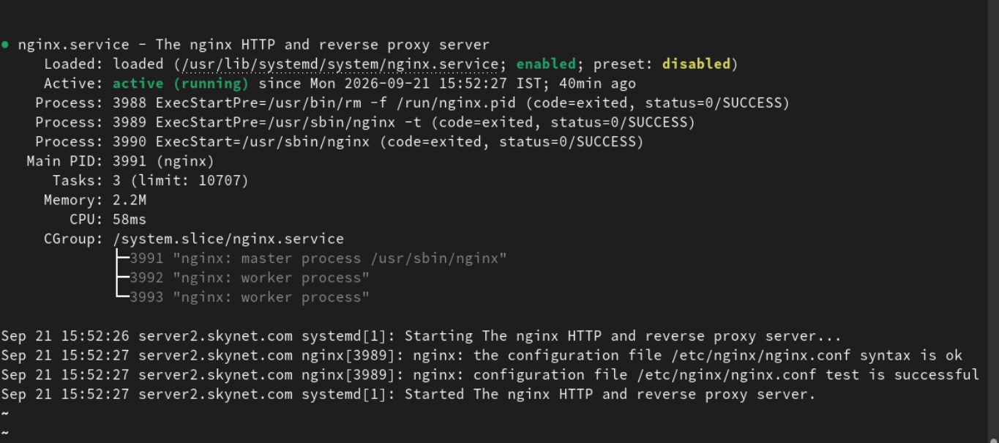
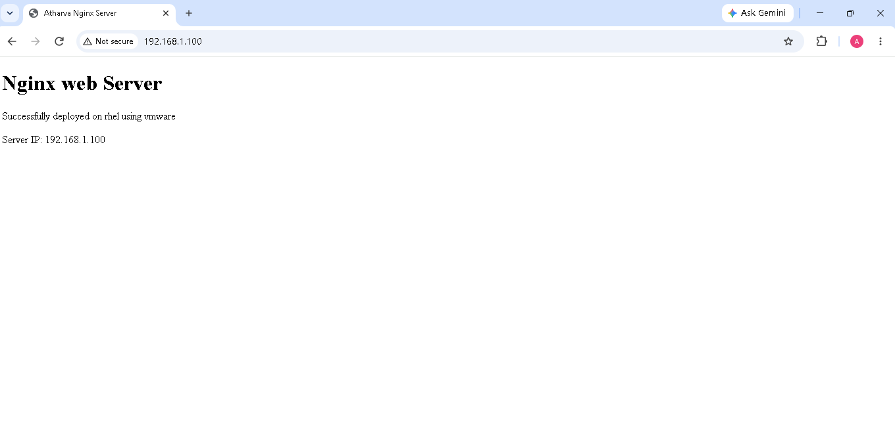

# Nginx Web Server Deployment on RHEL

## Project Overview

Deployed and configured an Nginx web server on Red Hat Enterprise Linux (RHEL) running in VMware Workstation.

## Environment

- Operating System: Red Hat Enterprise Linux (RHEL)
- Web Server: Nginx
- Virtualization: VMware Workstation
- Server IP: 192.168.1.100

## Tasks Performed

- Installed Nginx using DNF
- Started and enabled the Nginx service
- Created a custom HTML webpage
- Configured HTTP access through the firewall
- Tested Nginx using curl
- Verified Nginx configuration using nginx -t
- Accessed the web server from a Windows browser

## Important Commands

```bash
sudo dnf install nginx -y
sudo systemctl start nginx
sudo systemctl enable nginx
sudo systemctl status nginx
sudo nginx -t
curl http://localhost
sudo firewall-cmd --permanent --add-service=http
sudo firewall-cmd --reload
```
## Project Steps

### Step 1: Verify Nginx Service



Verified that the Nginx service is active and running on RHEL using `systemctl`.

### Step 2: Verify Nginx Configuration

![Nginx Configuration Test](nginx-test-Configuration.png
Verified the Nginx configuration syntax using `nginx -t` before running the web server.


## Screenshot


